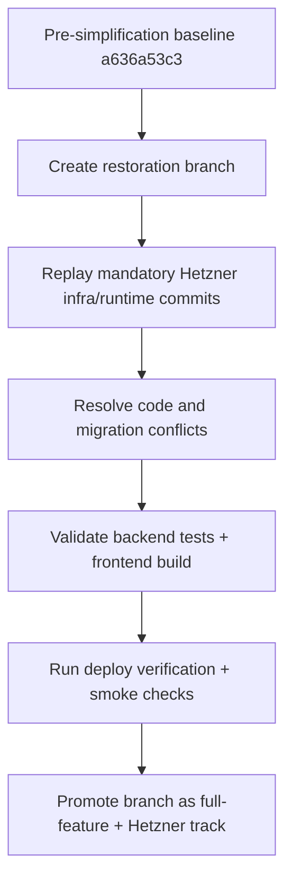

# Pre-Simplification Rewind + Hetzner Merge Plan

**Date:** 2026-04-05  
**Version:** 1.9.2  
**Status:** Active restoration strategy

---

## Goal
Restore the broad feature surface that existed before **The Great Simplification** while **preserving the current production-safe Hetzner deployment/runtime contract**.

This plan intentionally avoids a blind reset of `main`.

---

## Baseline Decision
### Selected rewind baseline
- **Baseline commit:** `a636a53c3`
- **Commit message:** `docs: final handoff for Sidebar UI Fix completion (v1.1.7)`

### Simplification boundary
- **Simplification starts at:** `2a3f8aa40`
- **Commit message:** `refactor: execute 'The Great Simplification' removing all non-core features (v1.2.0)`

### Why this baseline
This is the last known pre-simplification snapshot before the repo aggressively pruned features, controllers, pages, tests, migrations, and models.

---

## Why We Cannot Hard Reset `main`
A full hard reset to the older snapshot would likely reintroduce:
- DreamHost-oriented deployment assumptions
- stale websocket / Mercure naming and routing
- non-idempotent migrations
- runtime schema drift failures already fixed post-cutover
- missing ACL / nginx / systemd / geo / reverb / smoke-check hardening
- broken GitHub Actions deployment topology

So the correct strategy is:
1. branch from the pre-simplification baseline
2. replay modern infrastructure and runtime-hardening work onto that branch
3. resolve conflicts intentionally
4. validate backend, frontend, deploy verification, and smoke behavior

---

## High-Level Strategy

---

## Commit Classification
### A. Mandatory replay set — infrastructure / production runtime
These changes must survive the rewind because they define the real deployed topology.

Representative commit cluster:
- `11250c5ec` — deployment docs aligned to Hetzner + Vercel
- `59f132e38` — Hetzner nginx/systemd/scripts templates + frontend env alignment
- `ad963d99b` — deployment health endpoints + `deploy:verify`
- `f95017246` — post-deploy smoke checks
- `b55304b43` — smoke report artifacts + drift detection
- `d343ec817` — smoke diagnostics + remediation hints
- `973cb6eb9` — endpoint fingerprints
- `be414a3b3` — DNS appendix
- `4a5630bca` — smoke report drift diffing
- `efccf1e49` — smoke report notification publishing
- `300f30f77` — real Hetzner backend execution + database migration
- `6b492aaba` — deploy script privilege hardening
- `afa34211b` — websocket smoke handshake fix
- `9f73a29b9` — executable bits for ops scripts
- `847f43f26` — GitHub backend deploy switched from DreamHost to Hetzner
- `81781ffb1` — rustup cargo path in deploys
- `18f3539e9` — workflow stabilization
- `cead7dbc3` — frontend lockfile build fix
- `6e9e1e835` — ACL-based Hetzner deploy access
- `6f1251b18` — frontend CI runtime alignment
- `9b090bf9b` — nodeinfo guard + CI runtime fix
- `e0fee531a` / `604f9c759` — frontend workflow install strategy + smoke/config sync hardening
- `c037acb4f` / `fab438e0a` — nginx sync hardening for deploys
- `5b4c8673e` / `88b705dcf` / `e692027f0` — roast preview smoke handling

### B. Strongly recommended replay set — live runtime and schema safety
These are not purely Hetzner-specific, but they reduce known live breakage and should likely be replayed too.

Representative cluster:
- `88bbb1923` — console/runtime error sweep
- `310859b3a` — idempotent index optimization migration
- `0ce3dd4a7` — missing-column index guards
- `dad6c6d12` — block safety hardening
- `56daf322b` — notification route consistency
- `c7938c93c` — Sentry App Router modernization
- `a15296b79` — live dashboard API + realtime recovery
- `8357d83f3` — Hetzner route/schema drift repair
- `8cbd2ce3c` — match insights/private photo unlock restoration
- `2e0789400` — premium discovery filter schema/persistence restoration

### C. Skip replay on rewind branch — already present in the older baseline
These later commits restored features that should already exist once we rewind to pre-simplification.

Examples:
- friends restoration
- events restoration
- wallet restoration
- referrals/video restoration
- gifts restoration
- boosts restoration
- unlock restoration
- premium discovery restoration

Those should be used as references for bug fixes only, not blindly cherry-picked as primary restoration vehicles.

---

## Repository Scale Finding
A diff of `a636a53c3..HEAD` currently shows a **massive simplification delta**:
- **827 files changed**
- **20,665 insertions**
- **56,068 deletions**

This confirms that a rewind-merge branch is the right strategy. The simplification removed far more than can be cleanly reconstructed forever by archive-by-archive manual restoration.

---

## Execution Order
### Phase 1 — branch preparation
- create `restore/pre-simplification-hetzner`
- branch from `a636a53c3`
- snapshot replay manifest in the branch

### Phase 2 — infra replay
Replay only deployment/runtime commits first:
- workflows
- ops scripts
- nginx/systemd
- deploy verification
- smoke checks
- frontend production env contract

### Phase 3 — runtime safety replay
Replay or manually port:
- schema drift protections
- route/controller guards
- notification routing fixes
- dashboard/realtime contract fixes
- migration idempotency fixes
- logging ACL fixes

### Phase 4 — validate feature-rich branch
- backend tests
- frontend build
- smoke/report scripts syntax
- deploy verification contract

### Phase 5 — promote and continue feature reconciliation
- compare restored branch against `main`
- merge or fast-forward once stability is acceptable
- continue fixing any conflicts between old feature richness and modern runtime expectations

---

## Immediate Next Action
Create the restoration branch and push it to origin so the rewind track exists independently of `main`.
